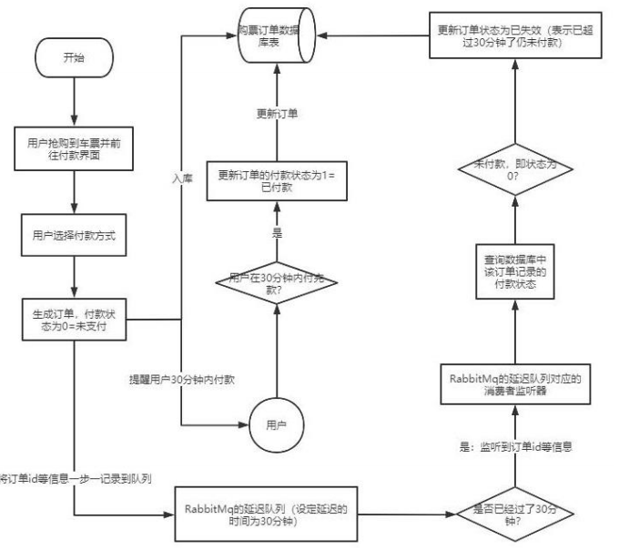

# RabbitMQ

## 核心理念


### 1. RabbitMQ的四大核心：

1. **生产者（Producer）**：这是产生数据并发送消息的程序。生产者可以是任何发送消息到RabbitMQ服务器的应用程序。
2. **交换机（Exchange）**：交换机是RabbitMQ中非常重要的一个部件，它接收来自生产者的消息，并根据一定的规则（由交换机类型决定）将这些消息推送到特定的队列或多个队列中，或者将消息丢弃。
3. **队列（Queue）**：队列是RabbitMQ内部使用的一种数据结构，尽管消息流经RabbitMQ和应用程序，但他们只能存储在队列中。队列仅受主机的内存和磁盘限制的约束，本质上是一个大的消息缓冲区。许多生产者可以将消息发送到一个队列，许多消费者可以尝试从一个队列接收数据。
4. **消费者（Consumer）**：消费者是等待接收消息的程序。消费者订阅队列并与RabbitMQ服务器建立网络连接以接收从队列中推送的消息。同一个应用程序既可以是生产者又可以是消费者。

这些核心概念共同构成了RabbitMQ消息队列系统的基本框架，使其能够实现消息的可靠传递和高效处理。

### 2. Connection 和 Broker

在RabbitMQ中，`Connection`和`Broker`是两个核心概念，它们各自在消息传递过程中扮演着重要的角色。

1. **Connection（连接）**：


	* **定义**：Connection是生产者或消费者与RabbitMQ服务器之间的TCP连接。在RabbitMQ中，无论是生产者发送消息还是消费者接收消息，都需要首先与RabbitMQ服务器建立连接。
	* **特性**：RabbitMQ采用了类似NIO（非阻塞I/O）的做法，通过在该连接上创建多个虚拟连接（即Channel）来进行消息的传递。这种复用方式不仅可以减少性能开销，也便于管理。
	* **作用**：Connection是RabbitMQ通信的基础，它确保了生产者、消费者与RabbitMQ服务器之间的可靠连接，从而保证了消息的可靠传递。
2. **Broker（消息代理）**：


	* **定义**：Broker是RabbitMQ服务器本身，也称为消息队列服务器或消息代理。它接收来自生产者的消息，并根据路由规则将消息转发给消费者。Broker在RabbitMQ系统中扮演着消息代理的中央角色，负责存储、路由和转发消息。
	* **组成**：Broker主要由Exchange（交换机）和Queue（队列）组成。Exchange用于接收来自生产者的消息，并根据路由规则将消息转发到相应的队列。Queue则用于存储等待被消费者消费的消息。
	* **功能**：Broker的主要功能包括接收消息、存储消息、路由消息和转发消息。它根据生产者发送的路由键和交换机类型，将消息路由到指定的队列中，并等待消费者从队列中取走消息。同时，Broker还提供了消息确认机制，确保消息被消费者成功处理后才会从队列中删除。
	* **集群**：为了提高系统的可用性、伸缩性和性能，可以将多个Broker组合成一个集群（Cluster）。集群内的各个Broker节点可以互相通信，共同对外提供服务。这样，即使某个Broker节点出现故障，其他节点仍然可以继续提供服务，保证了系统的稳定性和可靠性。

总的来说，Connection和Broker是RabbitMQ系统中不可或缺的两个核心概念。Connection负责确保生产者和消费者与RabbitMQ服务器之间的可靠连接；而Broker则负责消息的存储、路由和转发等功能，确保消息的可靠传递和处理。

### 3. Exchange Binding Queue

在RabbitMQ中，`Exchange`、`Binding`和`Queue`是三个核心概念，它们共同协作以实现消息的路由和传递。
1. **Exchange（交换机）**：


	* Exchange是RabbitMQ中的消息路由器。它接收来自生产者的消息，并根据一定的路由规则将消息转发到一个或多个队列。
	* RabbitMQ支持多种类型的Exchange，包括direct、topic、fanout和headers等。每种类型的Exchange都有其特定的路由算法。
2. **Binding（绑定）**：


	* Binding是Exchange和Queue之间的关联关系。它定义了消息如何从Exchange路由到Queue的规则。
	* 在创建Binding时，需要指定Exchange、Queue以及一个或多个Routing Key（路由键）。Routing Key是用于匹配消息的属性，以便将消息路由到正确的Queue。
3. **Queue（队列）**：


	* Queue是RabbitMQ中用于存储消息的容器。生产者将消息发送到Exchange，然后Exchange根据Binding中的路由规则将消息转发到相应的Queue。
	* 消费者从Queue中拉取消息并进行处理。一旦消息被消费者接收并处理完成，它就会被从Queue中移除。

因此，**Exchange Binding Queue**可以理解为RabbitMQ中的消息路由机制。生产者将消息发送到Exchange，Exchange根据Binding中的路由规则将消息转发到一个或多个Queue，然后由消费者从Queue中拉取消息并进行处理。这种机制使得RabbitMQ能够实现消息的可靠传递和高效处理。

### 4. AMQP default Exchange

在 RabbitMQ 中，AMQP default exchange 实际上是一个特殊的 Direct Exchange，它没有名字。这个默认交换机在 RabbitMQ 消息代理启动时就已经预先声明好了，并且每个新建的队列（queue）都会自动绑定到这个默认交换机上，绑定的路由键（routing key）名称与队列名称相同。

因此，当发送一个消息到默认交换机，并且指定了一个路由键时，RabbitMQ 会查找一个与该路由键名称相同的队列，并将消息发送到该队列。如果找不到与路由键匹配的队列，消息将会被丢弃。

由于默认交换机是隐式创建的，并且每个队列都自动绑定到它上面，因此不能显式地绑定或解绑队列到默认交换机，也不能删除默认交换机。

使用默认交换机的场景通常是在简单应用中，当生产者只需要将消息发送到具有特定名称的队列时，而不需要考虑复杂的路由逻辑。然而，在更复杂的场景中，可能需要使用其他类型的交换机（如 Direct、Fanout、Topic 或 Headers 交换机）来实现更灵活的路由和消息传递。


## 常用API示例

### 1. 连接到 RabbitMQ

```java
import com.rabbitmq.client.Channel;
import com.rabbitmq.client.Connection;
import com.rabbitmq.client.ConnectionFactory;

import java.io.IOException;
import java.util.concurrent.TimeoutException;

/**
 * @author : lichangxin
 * @create : 2024/5/22 16:39
 * @description
 */
public class RabbitmqConnectionUtils {


    public static Channel getChannel() throws IOException, TimeoutException {
        ConnectionFactory connectionFactory = new ConnectionFactory();
        connectionFactory.setHost("192.168.10.129");
        connectionFactory.setPort(5672);
        connectionFactory.setUsername("admin");
        connectionFactory.setPassword("admin");

        Connection connection = connectionFactory.newConnection();
        return connection.createChannel();
    }

}

```
### 2. channel.exchangeDeclare

`channel.exchangeDeclare` 用于创建一个交换器（Exchange）的方法

参数说明：

* `exchange`: 交换器的名称。
* `type`: 交换器的类型，它决定了消息如何路由到队列。RabbitMQ 支持多种类型的交换器，如 `direct`、`fanout`、`topic` 和 `headers`。
* `durable`: 一个布尔值，表示交换器是否是持久的。如果设置为 `true`，则即使 RabbitMQ 服务器重启，交换器仍然存在。如果设置为 `false`，则在服务器重启后交换器将被删除。
* `autoDelete`: 一个布尔值，表示当没有队列与交换器绑定时，是否自动删除该交换器。如果设置为 `true`，当没有队列与该交换器绑定时，交换器将被自动删除。
* `arguments`: 一个可选的参数，用于设置交换器的其他属性。

在调用 `channel.exchangeDeclare` 方法时，如果指定的交换器已经存在并且其属性与声明中的属性相匹配，则该方法不会产生任何效果。但是，如果交换器已经存在但属性不匹配，则通常会抛出一个错误。

```java
    channel.exchangeDeclare("my_exchange1", BuiltinExchangeType.DIRECT);
```

### 3. channel.queueDeclare

在RabbitMQ中，`channel.exchangeDeclare` 用于创建一个交换器（Exchange）。它负责接收消息并将它们路由到一个或多个队列。

`channel.exchangeDeclare` 方法的基本语法如下（使用RabbitMQ的Java客户端库）：


```java
channel.exchangeDeclare(String exchange, String type, boolean durable, boolean autoDelete, Map<String, Object> arguments) throws IOException;
```
参数说明：

* `exchange`：交换器的名称。
* `type`：交换器的类型，例如 "direct", "topic", "headers", "fanout" 等。这些类型决定了消息如何路由到队列。
* `durable`：是否设置为持久化。如果为true，则交换器会在RabbitMQ服务器重启后仍然存在。默认为false。
* `autoDelete`：当所有绑定到此交换器的队列都不再与此交换器绑定时，是否自动删除该交换器。默认为false。
* `arguments`：一个可选的参数映射，用于设置交换器的其他属性。不同的交换器类型可能支持不同的参数。


```java
channel.exchangeDeclare("my_exchange", BuiltinExchangeType.DIRECT, true, false, null);
```
如果尝试声明一个已经存在的交换器（并且参数与现有交换器的参数相匹配），RabbitMQ将不会执行任何操作，也不会报错。因此，在代码中多次声明相同的交换器通常是无害的。


### 4. channel.queueBind

`channel.queueBind` 用于将队列（Queue）绑定到交换器（Exchange）的方法。这个方法的作用是将队列与交换器之间建立一种关联，使得发送到交换器的消息能够根据路由键（Routing Key）被正确地路由到该队列。

参数说明：

* `queue`：队列的名称，表示要将哪个队列绑定到交换器。
* `exchange`：交换器的名称，表示要将队列绑定到哪个交换器。
* `routingKey`：路由键，是一个字符串，用于决定如何将消息从交换器路由到队列。当生产者发送消息到交换器时，会指定一个路由键，RabbitMQ 会根据这个路由键和队列与交换器之间的绑定关系，将消息路由到相应的队列。
* `arguments`：用于指定绑定时的一些额外参数。这些参数可以用于实现更复杂的路由逻辑或满足特定需求。

```java
channel.queueBind("my_queue", "my_exchange", "my_routing_key");
```
在这个示例中，我们将名为 `my_queue` 的队列绑定到名为 `my_exchange` 的交换器，并使用路由键 `my_routing_key`。这意味着发送到 `my_exchange` 交换器并使用路由键 `my_routing_key` 的消息将被路由到 `my_queue` 队列。

在调用 `channel.queueBind` 方法之前，必须确保队列和交换器已经存在。如果队列或交换器不存在，RabbitMQ 会抛出一个错误。如果队列已经与交换器绑定，并且绑定关系与新的绑定关系相同（即队列、交换器和路由键都相同），则 `channel.queueBind` 方法不会产生任何效果。但是，如果绑定关系不同，则 RabbitMQ 会抛出一个错误。


### 5. channel.basicPublish

`channel.basicPublish` 用于发布消息到交换器的方法。

参数说明：

1. `exchange`：交换器的名称。这指定了消息需要发送到哪个交换器。如果为空字符串（""），则会使用 RabbitMQ 的默认交换器（通常是名为 `amq.direct` 的直连交换器）。
2. `routingKey`：路由键。这是一个字符串，用于决定如何将消息从交换器路由到队列。路由键的具体作用取决于交换器的类型。
3. `props`（或 `basicProperties`）：消息的属性。这是一个可选参数，用于设置消息的各种属性，如内容类型（`contentType`）、优先级（`priority`）、持久化标志（`deliveryMode`，用于指定消息是否应被持久化到磁盘）等。这些属性通常被封装在 `AMQP.BasicProperties` 或类似的类中。
4. `body`：消息的内容。这是一个字节数组（`byte[]`），包含要发送的消息的实际数据。

示例：

```java
String exchangeName = "my_exchange";
String routingKey = "my_routing_key";
String message = "Hello, RabbitMQ!";

// 创建消息属性（这里仅设置了内容类型）
AMQP.BasicProperties properties = new AMQP.BasicProperties.Builder()
    .contentType("text/plain")
    .build();

// 发布消息到交换器
channel.basicPublish(exchangeName, routingKey, properties, message.getBytes("UTF-8"));
```

### 6. channel.basicConsume

`channel.basicConsume`用于创建一个消费者来订阅一个或多个队列，并接收队列中消息的方法。

使用 `channel.basicConsume` 方法时，需要提供队列的名称以及一个回调函数。当消息到达队列时，RabbitMQ 服务器会调用这个回调函数，并将消息作为参数传递给回调函数。

回调函数通常需要两个参数：一个 `channel` 对象和一个 `method` 对象。`channel` 对象是用来发送消息到队列的通道，而 `method` 对象则包含了关于消息的信息，如主题、内容、元数据等。

参数说明：

* `queue`：指定队列名称，用于接收消息。
* `auto_ack`：自动应答。当设置为 `true` 时，消费者成功接收消息后会自动向 RabbitMQ 服务器发送应答。如果设置为 `false`，则消费者需要显式地调用 `channel.basicAck` 方法来发送应答。
* `exclusive`：排他消费。如果设置为 `true`，则只有当前消费者可以消费队列中的消息，其他消费者无法从该队列接收消息。
* `nowait`：如果设置为 `true`，则该方法不会等待服务器确认消费者的请求。这可能会导致消息在消费者尚未准备好接收时被发送给它。

示例：

```java
String queueName = "my_queue";
boolean autoAck = false; // 不自动应答

// 创建一个回调函数来处理接收到的消息
Consumer<Delivery> consumer = (delivery) -> {
    String message = new String(delivery.getBody(), "UTF-8");
    System.out.println("Received message: " + message);

    // 在这里处理消息...

    // 显式地发送应答，确认消息已被成功处理
    channel.basicAck(delivery.getEnvelope().getDeliveryTag(), false);
};

// 订阅队列并接收消息
channel.basicConsume(queueName, autoAck, consumer);
```

### 7. demo

1. Producer

```java
import com.lcx.utils.RabbitmqConnectionUtils;
import com.rabbitmq.client.Channel;
import java.io.IOException;
import java.util.Scanner;
import java.util.concurrent.TimeoutException;

/**
 * @author : lichangxin
 * @create : 2024/5/23 9:24
 * @description
 */
public class ProducerDemo {

    public static void main(String[] args) {

        try {
            Channel channel = RabbitmqConnectionUtils.getChannel();
            channel.exchangeDeclare("demo_exchange1", "direct", false,true,null);
            channel.queueDeclare("demo_queue1",false,false,false,null);
            channel.queueBind("demo_queue1","demo_exchange1","demo_routingkey1");
            while (true) {
                Scanner input = new Scanner(System.in);
                channel.basicPublish("demo_exchange1","demo_routingkey1",null,input.nextLine().getBytes());
            }

        } catch (IOException e) {
            throw new RuntimeException(e);
        } catch (TimeoutException e) {
            throw new RuntimeException(e);
        }

    }

}

```

2. Consumer

```java

import com.lcx.utils.RabbitmqConnectionUtils;
import com.rabbitmq.client.CancelCallback;
import com.rabbitmq.client.Channel;
import com.rabbitmq.client.DeliverCallback;

import java.io.IOException;
import java.util.concurrent.TimeoutException;

/**
 * @author : lichangxin
 * @create : 2024/5/23 9:24
 * @description
 */
public class ConsumerDemo {

    public static void main(String[] args) {

        try {
            Channel channel = RabbitmqConnectionUtils.getChannel();

            //推送的消息如何进行消费的接口回调
            DeliverCallback deliverCallback=(consumerTag, delivery)->{
                String message= new String(delivery.getBody());
                System.out.println("thread1:" + message);
                channel.basicAck(delivery.getEnvelope().getDeliveryTag(),false);
            };
            //取消消费的一个回调接口 如在消费的时候队列被删除掉了
            CancelCallback cancelCallback=(consumerTag)->{
                System.out.println("消息消费被中断");
            };
            channel.basicConsume("demo_queue1", false,deliverCallback,cancelCallback);
        } catch (IOException e) {
            throw new RuntimeException(e);
        } catch (TimeoutException e) {
            throw new RuntimeException(e);
        }

        new Thread(()->{
            try {
                Channel channel = RabbitmqConnectionUtils.getChannel();
                //推送的消息如何进行消费的接口回调
                DeliverCallback deliverCallback=(consumerTag, delivery)->{
                    String message= new String(delivery.getBody());
                    System.out.println("thread2:" + message);
//                    channel.basicAck(delivery.getEnvelope().getDeliveryTag(),false);   // autoAck = false 时 需要手动应答
                };
                //取消消费的一个回调接口 如在消费的时候队列被删除掉了
                CancelCallback cancelCallback=(consumerTag)->{
                    System.out.println("消息消费被中断");
                };
                channel.basicConsume("demo_queue1", true,deliverCallback,cancelCallback);
            } catch (IOException e) {
                throw new RuntimeException(e);
            } catch (TimeoutException e) {
                throw new RuntimeException(e);
            }
        }).start();
    }

}

```

3. RabbitmqConnectionUtils

```java
import com.rabbitmq.client.Channel;
import com.rabbitmq.client.Connection;
import com.rabbitmq.client.ConnectionFactory;

import java.io.IOException;
import java.util.concurrent.TimeoutException;

/**
 * @author : lichangxin
 * @create : 2024/5/22 16:39
 * @description
 */
public class RabbitmqConnectionUtils {


    public static Channel getChannel() throws IOException, TimeoutException {
        ConnectionFactory connectionFactory = new ConnectionFactory();
        connectionFactory.setHost("192.168.10.129");
        connectionFactory.setPort(5672);
        connectionFactory.setUsername("admin");
        connectionFactory.setPassword("admin");

        Connection connection = connectionFactory.newConnection();
        return connection.createChannel();
    }


}

```

## 消息可靠性

### 1. 消息自动应答和手动应答

RabbitMQ 的消费者（Consumer）在处理消息时，可以选择自动应答（Automatic Acknowledgement）或手动应答（Manual Acknowledgement）两种模式。

1. **自动应答**：


	* 当消费者从队列中获取消息时，RabbitMQ 会自动将该消息标记为已处理并从队列中删除，而无需消费者显式地发送任何确认。
	* 这种模式在某些场景下可能很方便，因为它减少了消费者与 RabbitMQ 服务器之间的交互次数。
	* 然而，自动应答模式也存在一些问题。例如，如果消费者在处理消息时崩溃或遇到其他错误，那么该消息将永远丢失，因为 RabbitMQ 已经将其从队列中删除。
2. **手动应答**：


	* 在手动应答模式下，消费者从队列中获取消息后，需要显式地向 RabbitMQ 发送确认消息（通常是通过调用 `basicAck` 方法）来告诉 RabbitMQ 该消息已经被成功处理。
	* RabbitMQ 在接收到消费者的确认消息后，才会将该消息从队列中删除。
	* 如果消费者在处理消息时崩溃或遇到其他错误，并且没有发送确认消息，那么 RabbitMQ 会将该消息重新放回队列，以便其他消费者或同一个消费者重新处理。
	* 手动应答模式提供了更高的可靠性，因为它可以确保即使消费者在处理消息时遇到错误，消息也不会丢失。
	* 要启用手动应答模式，消费者需要在调用 `basicConsume` 方法时设置 `autoAck` 参数为 `false`。

如果希望简化代码并提高处理速度，那么可以选择自动应答模式。如果需要更高的可靠性和容错性，那么手动应答模式可能更适合。

### 2. 持久化

RabbitMQ 的队列持久化和消息持久化是确保在 RabbitMQ 服务重启或崩溃时，队列和消息不会丢失的重要机制。

1. **队列持久化**：


	* 当队列被声明为持久化时，即使 RabbitMQ 服务重启，队列也不会丢失。这意味着队列的元数据（如名称、属性等）将被保存在磁盘上，并在服务重启后恢复。
	* 要将队列声明为持久化，需要在声明队列时设置 `durable` 参数为 `true`。例如，在 RabbitMQ 的 Java 客户端中，可以使用 `channel.queueDeclare(queueName, true, false, false, null)` 方法来声明一个持久化队列。
	* 需要注意的是，即使队列被声明为持久化，也并不能保证队列中的消息在 RabbitMQ 服务重启后不会丢失。要确保消息不会丢失，还需要进行消息持久化。
2. **消息持久化**：


	* 消息持久化意味着消息将被保存到磁盘上，并在 RabbitMQ 服务重启后恢复。这样，即使 RabbitMQ 服务崩溃或重启，也不会丢失已经发布的消息。
	* 要将消息标记为持久化，需要在发布消息时设置相关的属性。在 RabbitMQ 的 Java 客户端中，可以通过 `MessageProperties.PERSISTENT_TEXT_PLAIN` 或 `MessageProperties.PERSISTENT_BASIC` 等常量来创建持久化消息。
	* 需要注意的是，即使消息被标记为持久化，也并不能保证在 RabbitMQ 服务崩溃时消息不会丢失。因为 RabbitMQ 在将消息写入磁盘之前会先将消息保存在内存中，如果 RabbitMQ 在将消息写入磁盘之前崩溃，那么这些消息可能会丢失。但是，通过设置 RabbitMQ 的持久化配置和确保足够的磁盘空间，可以最大程度地减少这种情况的发生。

3. **交换机持久化**


    * 将durable参数设置为true来实现的。这样，即使在RabbitMQ服务器重启后，该交换机也不会丢失，相关的元数据（如交换机名称、类型、绑定等）都会被保留。

总的来说，RabbitMQ 的队列持久化和消息持久化是确保分布式系统中消息可靠传递的重要机制。通过合理配置和使用这些机制，可以确保在 RabbitMQ 服务重启或崩溃时，队列和消息不会丢失。

**设置持久化样例**

```java
import com.rabbitmq.client.AMQP.BasicProperties;  
import com.rabbitmq.client.Channel;  
import com.rabbitmq.client.Connection;  
import com.rabbitmq.client.ConnectionFactory;  
  
import java.io.IOException;  
import java.util.concurrent.TimeoutException;  
  
public class RabbitMQPersistentMessaging {  
  
    private static final String QUEUE_NAME = "my_persistent_queue";  
    private static final String EXCHANGE_NAME = "my_persistent_exchange";  
  
    public static void main(String[] args) throws IOException, TimeoutException {  
        ConnectionFactory factory = new ConnectionFactory();  
        factory.setHost("localhost"); // 设置RabbitMQ服务器地址  
        try (Connection connection = factory.newConnection();  
             Channel channel = connection.createChannel()) {  
  
            // 声明一个持久的、直连类型的交换机  
            channel.exchangeDeclare(EXCHANGE_NAME, "direct", true); // 第三个参数为true表示交换机持久化  
  
            // 声明一个持久的队列  
            channel.queueDeclare(QUEUE_NAME, true, false, false, null); // 第二个参数为true表示队列持久化  
  
            // 绑定队列到交换机上  
            channel.queueBind(QUEUE_NAME, EXCHANGE_NAME, "my_routing_key");  
  
            // 发送持久化的消息  
            String message = "Hello, RabbitMQ Persistent Messaging!";  
            BasicProperties properties = new BasicProperties.Builder()  
                    .deliveryMode(2) // 设置消息的delivery mode为2，表示消息持久化  
                    .build();  
            channel.basicPublish(EXCHANGE_NAME, "my_routing_key", properties, message.getBytes("UTF-8"));  
  
            System.out.println(" [x] Sent '" + message + "'");  
        }  
    }  
}
```

### 3. 发布确认模式

RabbitMQ的发布确认（Publisher Confirms）是一种高级特性，用于增强消息发布的可靠性。在启用发布确认后，生产者（Producer）能够得到Broker端关于每条消息是否已成功接收的确认信息。这确保了生产者能够知道其发送的消息是否已经被RabbitMQ服务器正确地接收。

RabbitMQ发布确认模式有三种形式：

1. **单条确认（Single Publisher Confirm）**：这是最基本的确认模式。在发布一条消息后，生产者会等待服务器确认该消息是否成功接收。这种模式简单，但吞吐量有限，因为每发送一条消息都需要等待一次确认。`channel.waitForConfirms();`
2. **批量确认（Batch Confirm）**：生产者可以批量发布消息，并等待批量的同步确认。这种模式相对简单，具有合理的吞吐量，但在判断何时出现问题时可能较为困难。不知道是哪个消息出现问题.`channel.waitForConfirms();`
3. **异步确认（Async Confirm）**：异步确认模式允许生产者在发送消息后立即继续处理其他任务，而不必等待服务器的确认。服务器在处理完消息后会发送一个异步确认消息给生产者。这种模式可以提高吞吐量，但生产者需要处理异步确认消息的接收和解析.`channel.addConfirmListener(ackCallback, nackCallback);`

要启用发布确认，生产者需要在与RabbitMQ服务器建立连接后，通过调用通道的`confirmSelect()`方法来实现。在发布消息后，生产者可以通过检查RabbitMQ返回的确认信息来确定消息是否已成功接收。如果生产者没有收到确认信息或收到拒绝信息，可以根据需要进行相应的处理，如重新发布丢失的消息或记录错误日志等。

发布确认仅确保消息已经被RabbitMQ服务器成功接收，但并不能保证消息一定能够被消费者成功处理。为了确保消息的可靠传递和处理，还需要结合其他RabbitMQ的特性（如持久化、死信队列等）来进行综合配置和使用。

**发布确认三种模式比较**

```java
package com.lcx.producer;

import com.lcx.utils.RabbitmqConnectionUtils;
import com.rabbitmq.client.Channel;
import com.rabbitmq.client.ConfirmCallback;

import java.util.concurrent.ConcurrentNavigableMap;
import java.util.concurrent.ConcurrentSkipListMap;

/**
 * @author : lichangxin
 * @create : 2024/5/23 11:12
 * @description 发布确认模式生产者
 */
public class ProducerConfirm {


    public static final String QUEUE_NAME = "confirm_queue";

    public static void main(String[] args) {

        singleConfirm();
        batchConfirm();
        syncConfirm();

    }

    /**
     * 单条确认
     */
    public static void singleConfirm() {
        try {
            Channel channel = RabbitmqConnectionUtils.getChannel();

            channel.confirmSelect();
            channel.queueDeclare(QUEUE_NAME,false,false,false,null);

            long startTime = System.currentTimeMillis();
            for (int i = 0; i < 10000; i++) {
                channel.basicPublish("",QUEUE_NAME,null,(i+"").getBytes());
                channel.waitForConfirms();
            }
            long endTime = System.currentTimeMillis();

            System.out.println("[单条确认]发布10000条消息，耗时："+(endTime-startTime)+"ms");

        } catch (Exception e) {
            throw new RuntimeException(e);
        }
    }

    /**
     * 批量确认
     */
    public static void batchConfirm() {

        int batchSize = 100;

        int unConfirmMsgCount = 0;

        try {
            Channel channel = RabbitmqConnectionUtils.getChannel();

            channel.confirmSelect();
            channel.queueDeclare(QUEUE_NAME,false,false,false,null);

            long startTime = System.currentTimeMillis();
            for (int i = 0; i < 10000; i++) {
                channel.basicPublish("",QUEUE_NAME,null,(i+"").getBytes());
                unConfirmMsgCount++;
                if(batchSize == unConfirmMsgCount) {
                    channel.waitForConfirms();
                    unConfirmMsgCount = 0;
                }
            }
            if(unConfirmMsgCount > 0) {
                channel.waitForConfirms();
            }
            long endTime = System.currentTimeMillis();

            System.out.println("[批量确认]发布10000条消息，耗时："+(endTime-startTime)+"ms");

        } catch (Exception e) {
            throw new RuntimeException(e);
        }
    }

    public static void syncConfirm() {
        try (Channel channel = RabbitmqConnectionUtils.getChannel()) {
            channel.queueDeclare(QUEUE_NAME, false, false, false, null);
            //开启发布确认
            channel.confirmSelect();
            /**
             * 线程安全有序的一个哈希表，适用于高并发的情况
             * 1.轻松的将序号与消息进行关联
             * 2.轻松批量删除条目 只要给到序列号
             * 3.支持并发访问
             */
            ConcurrentSkipListMap<Long, String> outstandingConfirms = new
                    ConcurrentSkipListMap<>();
            /**
             * 确认收到消息的一个回调
             * 1.消息序列号
             * 2.true 可以确认小于等于当前序列号的消息
             * false 确认当前序列号消息
             */
            ConfirmCallback ackCallback = (sequenceNumber, multiple) -> {
                if (multiple) {
                    //返回的是小于等于当前序列号的未确认消息 是一个 map
                    ConcurrentNavigableMap<Long, String> confirmed =
                            outstandingConfirms.headMap(sequenceNumber, true);
                    //清除该部分未确认消息
                    confirmed.clear();
                }else{
                    //只清除当前序列号的消息
                    outstandingConfirms.remove(sequenceNumber);
                }
            };
            ConfirmCallback nackCallback = (sequenceNumber, multiple) -> {
                String message = outstandingConfirms.get(sequenceNumber);
                System.out.println("发布的消息"+message+"未被确认，序列号"+sequenceNumber);
            };
            /**
             * 添加一个异步确认的监听器
             * 1.确认收到消息的回调
             * 2.未收到消息的回调
             */
            channel.addConfirmListener(ackCallback, nackCallback);
            long begin = System.currentTimeMillis();
            for (int i = 0; i < 10000; i++) {
                String message = "消息" + i;
                /**
                 * channel.getNextPublishSeqNo()获取下一个消息的序列号
                 * 通过序列号与消息体进行一个关联
                 * 全部都是未确认的消息体
                 */
                outstandingConfirms.put(channel.getNextPublishSeqNo(), message);
                channel.basicPublish("", QUEUE_NAME, null, message.getBytes());
            }
            long end = System.currentTimeMillis();
            System.out.println("[批量确认]发布10000条消息，耗时：" + (end - begin) +
                    "ms");
        } catch (Exception e) {
            e.printStackTrace();
        }
    } 
}

```

运行结果：


##  消息分发策略


### 1. 不公平分发

RabbitMQ 的“不公平分发”（Unfair Dispatch）通常指的是在多个消费者（Consumers）同时订阅同一个队列（Queue）时，消息的分发并不是均匀或公平的，这可能导致某些消费者过载而其他消费者空闲，从而导致负载不均衡和性能问题。

不公平分发可能由以下原因造成：

1. **消费者处理速度不同**：如果某些消费者处理消息的速度比其他消费者快，那么它们可能会更快地完成任务并请求更多的消息，而处理速度较慢的消费者可能会落后并导致消息积压。
2. **RabbitMQ 的默认分发策略**：RabbitMQ 的默认分发策略是轮询（Round-robin），它按照顺序将消息分发给消费者。但是，如果某个消费者在处理消息时遇到延迟或阻塞，RabbitMQ 并不会自动检测并将消息重新分发给其他消费者。

为了解决不公平分发的问题，可以采取以下策略：

1. **使用公平分发**：RabbitMQ 支持公平分发（Fair Dispatch）模式。在这种模式下，消费者会告诉 RabbitMQ 它们何时准备好接收下一条消息。当一个消费者正在处理消息时，RabbitMQ 不会将新的消息分发给该消费者，直到它确认已经处理完当前的消息。这样可以确保所有消费者都能公平地接收到消息。
2. **手动应答**：在 RabbitMQ 中，消费者可以手动发送消息确认（ack）给 RabbitMQ，告诉它消息已经被成功处理。如果消费者在处理消息时失败或崩溃，RabbitMQ 可以将消息重新放入队列以便其他消费者再次处理。这种机制可以与公平分发结合使用，以确保消息被正确处理和分发。
3. **调整消费者数量**：如果可能的话，可以增加或减少消费者的数量以平衡负载。但是，这通常需要一些试错和调整来找到最佳的消费者数量。
4. **使用优先级队列**：RabbitMQ 支持优先级队列，可以根据消息的优先级进行分发。这可以帮助确保高优先级的消息优先被处理。


在RabbitMQ中，公平分发（Fair Dispatch）是一种确保消息公平地分配给消费者的机制。在公平分发模式下，RabbitMQ会尽量将消息均匀分配给各个消费者，而不是简单地按照轮询方式分发。以下是如何在RabbitMQ中使用公平分发的步骤：

### 2. 解决不公平分发常用策略

1. **设置消费者手动应答（Manual Acknowledgment）**：
   在RabbitMQ中，消费者需要手动发送消息确认（ack）给RabbitMQ，以告诉它消息已经被成功处理。这是实现公平分发的关键步骤。在消费者代码中，需要将ack模式设置为手动（manual），而不是默认的自动（auto）。

   对于Spring AMQP，可以在`@RabbitListener`注解中设置`ackMode`属性为`"MANUAL"`，或者在配置文件中设置`spring.rabbitmq.listener.simple.acknowledge-mode=manual`。

   示例代码（Spring AMQP）：
   ```java
   @RabbitListener(queues = "your_queue", ackMode = "MANUAL")
   public void handleMessage(Message message) {
       try {
           // 处理消息
           // ...
   
           // 消息处理成功后发送ack
           channel.basicAck(message.getMessageProperties().getDeliveryTag(), false);
       } catch (Exception e) {
           // 处理异常，可能需要将消息重新入队或者记录日志
           // ...
   
           // 消息处理失败时，可以选择不发送ack，让RabbitMQ重试发送消息，或者发送nack并设置requeue参数来决定是否重新入队
           channel.basicNack(message.getMessageProperties().getDeliveryTag(), false, true);
       }
   }
   ```

2. **限制消费者的预取数量（Prefetch Count）**：
   预取数量决定了RabbitMQ在消费者未确认消息之前可以发送给该消费者的消息数量。为了公平分发，需要将预取数量设置为1。这样，只有当消费者处理完当前消息并发送ack之后，RabbitMQ才会发送下一条消息给它。

   对于Spring AMQP，可以在配置文件中设置`spring.rabbitmq.listener.simple.prefetch=1` 或者 `channel.basicQos(1)`。

3. **确保所有消费者都配置为公平分发**：
   如果队列有多个消费者，需要确保所有消费者都配置为公平分发模式，否则可能会导致某些消费者过载而其他消费者空闲。

通过以上步骤，就可以在RabbitMQ中实现公平分发了。这样，无论消费者的处理速度如何，RabbitMQ都会尽量将消息均匀分配给它们，从而避免某些消费者过载而其他消费者空闲的情况。


本身消息的发送就是异步发送的，所以在任何时候，channel 上肯定不止只有一个消息另外来自消费者的手动确认本质上也是异步的。因此这里就存在一个未确认的消息缓冲区，因此希望开发人员能限制此缓冲区的大小，以避免缓冲区里面无限制的未确认消息问题。这个时候就可以通过使用 basic.qos 方法设置“预取计数”值来完成的。该值定义通道上允许的未确认消息的最大数量。一旦数量达到配置的数量，RabbitMQ 将停止在通道上传递更多消息，除非至少有一个未处理的消息被确认，例如，假设在通道上有未确认的消息 5、6、7，8，并且通道的预取计数设置为 4，此时 RabbitMQ 将不会在该通道上再传递任何消息，除非至少有一个未应答的消息被 ack。比方说 tag=6 这个消息刚刚被确认 ACK，RabbitMQ 将会感知这个情况到并再发送一条消息。消息应答和 QoS 预取值对用户吞吐量有重大影响。通常，增加预取将提高向消费者传递消息的速度。虽然自动应答传输消息速率是最佳的，但是，在这种情况下已传递但尚未处理的消息的数量也会增加，从而增加了消费者的 RAM 消耗(随机存取存储器)应该小心使用具有无限预处理的自动确认模式或手动确认模式，消费者消费了大量的消息如果没有确认的话，会导致消费者连接节点的内存消耗变大，所以找到合适的预取值是一个反复试验的过程，不同的负载该值取值也不同 100 到 300 范围内的值通常可提供最佳的吞吐量，并且不会给消费者带来太大的风险。预取值为 1 是最保守的。当然这将使吞吐量变得很低，特别是消费者连接延迟很严重的情况下，特别是在消费者连接等待时间较长的环境中。对于大多数应用来说，稍微高一点的值将是最佳的。


## Exchange 交换机

RabbitMQ 消息传递模型的核心思想是: 生产者生产的消息从不会直接发送到队列。实际上，通常生产者甚至都不知道这些消息传递传递到了哪些队列中。相反，生产者只能将消息发送到交换机(exchange)，交换机工作的内容非常简单，一方面它接收来自生产者的消息，另一方面将它们推入队列。交换机必须确切知道如何处理收到的消息。是应该把这些消息放到特定队列还是说把他们到许多队列中还是说应该丢弃它们。这就的由交换机的类型来决


### 1. 常用交换机的类型

总共有以下类型：

* 直接(direct)
* 主题(topic)
* 标题(headers)
* 扇出(fanout)

1. **Direct Exchange（直连交换机）**


	* 特点：消息队列通过routingKey与交换机进行绑定，相同的routingKey会获得相同的消息。
	* 工作原理：当生产者发送消息到直连交换机时，需要指定一个routingKey。交换机会将消息路由到所有与该routingKey绑定的队列中。
	* 应用场景：适用于有明确路由规则的场景，如根据订单ID将订单消息路由到对应的订单处理队列。
2. **Fanout Exchange（扇出交换机）**


	* 特点：类似于广播，只要队列与该类型的交换机绑定，所有发送到该交换机的信息都会被转发到所有与之绑定的队列，与routingKey无关。
	* 工作原理：当生产者发送消息到扇出交换机时，交换机会将消息路由到所有与之绑定的队列中，而不关心routingKey的值。
	* 应用场景：适用于需要将消息广播到多个消费者或队列的场景，如日志记录、实时监控等。
3. **Topic Exchange（主题交换机）**


	* 特点：模糊的routingKey的匹配模式，其中`*`代表必须为一个单词，`#`代表零个或多个单词。
	* 工作原理：当生产者发送消息到主题交换机时，需要指定一个routingKey。交换机会将消息路由到所有与routingKey匹配的队列中。匹配规则是基于routingKey和队列绑定时指定的通配符模式。
	* 应用场景：适用于需要根据多个条件进行路由的场景，如根据用户ID和订单类型将订单消息路由到不同的处理队列。
发送到类型是 topic 交换机的消息的 routing_key 不能随意写，必须满足一定的要求，它必须是一个单词列表，以点号分隔开。这些单词可以是任意单词，比如说："stock.usd.nyse", "nyse.vmw", "quick.orange.rabbit".这种类型的。当然这个单词列表最多不能超过 255 个字节。

4. **Header Exchange（头交换机）**


	* 特点：不依赖于routingKey进行路由，而是根据消息头的值进行路由。
	* 工作原理：当生产者发送消息到头交换机时，需要指定一组消息头。交换机会根据队列绑定时指定的匹配规则（一个或多个键值对）将消息路由到符合条件的队列中。
	* 应用场景：适用于需要根据复杂条件进行路由的场景，但由于头交换机性能较差，因此在实际应用中并不常用。

这四种交换机类型各有特点，适用于不同的应用场景。在选择交换机类型时，需要根据具体的业务需求和场景来权衡各种因素，如性能、灵活性、可维护性等。

### 2. 其他交换机

RabbitMQ中的Dead Letter Exchanges（DLX）和Alternate Exchanges是两种不同的机制，用于处理无法被正常路由或消费的消息。

1. Dead Letter Exchanges（DLX）

DLX，即死信交换器，是一个特殊的交换机，用于接收那些无法被消费者正常处理的消息，也就是所谓的“死信”。这些死信可能是由于以下原因产生的：

- 消息被拒绝（basic.reject）并且设置了`requeue=false`。
- 消息过期（TTL）。
- 队列达到最大长度限制。

当消息变成死信后，如果这个消息所在的队列存在`x-dead-letter-exchange`参数，那么它会被发送到该参数对应的交换器上，这个交换器就是死信交换器。与这个死信交换器绑定的队列就是死信队列，这些消息将在死信队列中等待被处理。

2.  Alternate Exchanges

Alternate Exchanges（备用交换机）是RabbitMQ中的一种可选功能，用于在消息无法路由到任何队列时提供一个备用的路由路径。当Exchange收到一个消息，但找不到与消息的Routing Key匹配的Queue时，如果为该Exchange配置了Alternate Exchange，则消息会被转发到Alternate Exchange，进而可能被路由到其他Queue。

Alternate Exchanges与DLX在用途上有所不同。DLX主要用于处理那些已经到达Queue但无法被消费者正常处理的消息，而Alternate Exchanges则用于处理那些因无法找到匹配的Queue而无法被路由的消息。


## Exchange 交换机样例

**工具类**

```java
import com.rabbitmq.client.Channel;
import com.rabbitmq.client.Connection;
import com.rabbitmq.client.ConnectionFactory;

import java.io.IOException;
import java.util.concurrent.TimeoutException;

/**
 * @author : lichangxin
 * @create : 2024/5/22 16:39
 * @description
 */
public class RabbitmqUtils {


    public static Channel getChannel() throws IOException, TimeoutException {
        ConnectionFactory connectionFactory = new ConnectionFactory();
        connectionFactory.setHost("192.168.10.129");
        connectionFactory.setPort(5672);
        connectionFactory.setUsername("admin");
        connectionFactory.setPassword("admin");

        Connection connection = connectionFactory.newConnection();
        return connection.createChannel();
    }

    public static void CreatConsumer(String queueName) throws Exception {

        Channel channel = getChannel();

        channel.basicConsume(queueName,true,(consumerTag,message)->{
            System.out.println("["+queueName+"]接收到的消息："+new String(message.getBody()));
        },consumerTag->{
            System.out.println("["+queueName+"]消息接收失败");
        });

    }

}

```


### 1. Direct Exchange

```java
import com.lcx.utils.RabbitmqUtils;
import com.rabbitmq.client.BuiltinExchangeType;
import com.rabbitmq.client.Channel;


/**
 * @author : lichangxin
 * @create : 2024/5/23 14:50
 * @description
 */
public class DirectExchange {

    public static void main(String[] args) throws Exception{

//        DirectExchangeTest();
        DirectExchangeTest();
        RabbitmqUtils.CreatConsumer("direct_queue");

    }


    public static void DirectExchangeTest() throws Exception{

        Channel channel = RabbitmqUtils.getChannel();

        channel.exchangeDeclare("direct_exchange", BuiltinExchangeType.DIRECT,false);
        channel.queueDeclare("direct_queue",false,false,false,null);
//        channel.queueBind("direct_queue","direct_exchange","direct_routing");
        // direct 类型的交换机，不会识别routing key 通配符
        channel.queueBind("direct_queue","direct_exchange","direct_routing2#");
//        channel.queueBind("direct_queue","direct_exchange","direct_routing21");
        channel.basicPublish("direct_exchange","direct_routing21",null,"direct_routing".getBytes());


    }


}

```

### 2. Fanout Exchange

```java
import com.lcx.utils.RabbitmqUtils;
import com.rabbitmq.client.BuiltinExchangeType;
import com.rabbitmq.client.Channel;

/**
 * @author : lichangxin
 * @create : 2024/5/24 11:44
 * @description
 */
public class FanoutExchange {

    public static void main(String[] args) throws Exception{

        FanoutExchangeTest();
        RabbitmqUtils.CreatConsumer("fanout_queue");

    }


    public static void FanoutExchangeTest() throws Exception{

        Channel channel = RabbitmqUtils.getChannel();

        channel.exchangeDeclare("fanout_exchange", BuiltinExchangeType.FANOUT,false);
        channel.queueDeclare("fanout_queue",false,false,false,null);
        // FANOUT 类型的交换机，与 routing key 无关，会向 exchange 上的所有队列发送消息
        channel.queueBind("fanout_queue","fanout_exchange","fanout_routing1312331232");
        channel.basicPublish("fanout_exchange","fanout_routing21222",null,"fanout_routing".getBytes());


    }
}
```

### 3. Topic Exchange

```java
import com.lcx.utils.RabbitmqUtils;
import com.rabbitmq.client.BuiltinExchangeType;
import com.rabbitmq.client.Channel;

/**
 * @author : lichangxin
 * @create : 2024/5/24 11:47
 * @description
 */
public class TopicExchange {
    public static void main(String[] args) throws Exception{

        TopicExchangeTest();
        RabbitmqUtils.CreatConsumer("topic_queue1");
        RabbitmqUtils.CreatConsumer("topic_queue2");

    }


    public static void TopicExchangeTest() throws Exception{

        Channel channel = RabbitmqUtils.getChannel();

        channel.exchangeDeclare("topic_exchange", BuiltinExchangeType.TOPIC ,false);
        channel.queueDeclare("topic_queue1",false,false,false,null);
        channel.queueDeclare("topic_queue2",false,false,false,null);
        // TOPIC 类型的交换机，能够匹配通配符
        /**
         * 发送到类型是 topic 交换机的消息的 routing_key 不能随意写，必须满足一定的要求，它必须是一个单
         * 词列表，以点号分隔开。这些单词可以是任意单词，比如说："stock.usd.nyse", "nyse.vmw",
         * "quick.orange.rabbit".这种类型的。当然这个单词列表最多不能超过 255 个字节。
         */
        channel.queueBind("topic_queue1","topic_exchange","topic.#");
        channel.queueBind("topic_queue2","topic_exchange","topic.routing2");
        channel.basicPublish("topic_exchange","topic.routing2",null,"topic_routing".getBytes());


    }
}

```

### 4. Headers Exchange

```java
import com.lcx.utils.RabbitmqUtils;
import com.rabbitmq.client.AMQP;
import com.rabbitmq.client.BuiltinExchangeType;
import com.rabbitmq.client.Channel;

import java.util.HashMap;
import java.util.Map;


/**
 * @author : lichangxin
 * @create : 2024/5/24 14:00
 * @description
 */
public class HeaderExchange {


    public static void main(String[] args) throws Exception {

        headerExchangeTest();
        RabbitmqUtils.CreatConsumer("queue.headers.a");
        RabbitmqUtils.CreatConsumer("queue.headers.b");
    }

    public static void headerExchangeTest() throws Exception {

        Channel channel = RabbitmqUtils.getChannel();
        channel.confirmSelect();
        channel.exchangeDeclare("exchange.headers", BuiltinExchangeType.HEADERS,false);

        channel.queueDeclare("queue.headers.a", false, false, false, null);
        channel.queueDeclare("queue.headers.b", false, false, false, null);


         // 所有的条件都必须满足
        Map<String, Object> headers1 = new HashMap<>();
        headers1.put("color", "blue");
        headers1.put("size", "large");
        headers1.put("x-match", "all");
        channel.queueBind("queue.headers.a", "exchange.headers", "", headers1);

        Map<String, Object> headers2 = new HashMap<>();
        headers2.put("color", "red");
        headers2.put("size", "small");
        headers2.put("x-match", "any"); // 至少一个条件需要满足

        channel.queueBind("queue.headers.b", "exchange.headers", "", headers2);

        // 发送一个匹配header_queue1的消息
        Map<String, Object> messageHeaders1 = new HashMap<>();
        messageHeaders1.put("color", "blue1");
        messageHeaders1.put("size", "large");
        AMQP.BasicProperties properties1 = new AMQP.BasicProperties.Builder()
                .headers(messageHeaders1)
                .build();
        String messageBody1 = "Message for header_queue1";
        channel.basicPublish("exchange.headers", "", properties1, messageBody1.getBytes());

        // 发送一个匹配header_queue2的消息
        Map<String, Object> messageHeaders2 = new HashMap<>();
        messageHeaders2.put("color", "red");
        AMQP.BasicProperties properties2 = new AMQP.BasicProperties.Builder()
                .headers(messageHeaders2)
                .build();
        String messageBody2 = "Message for header_queue2";
        channel.basicPublish("exchange.headers", "", properties2, messageBody2.getBytes());


    }
}

```

## 死信队列

### 1. 概念

死信，顾名思义就是无法被消费的消息，字面意思可以这样理解，一般来说，producer 将消息投递到 broker 或者直接到 queue 里了，consumer 从 queue 取出消息进行消费，但某些时候由于特定的原因导致 queue 中的某些消息无法被消费，这样的消息如果没有后续的处理，就变成了死信，有死信自然就有了死信队列。应用场景:为了保证订单业务的消息数据不丢失，需要使用到 RabbitMQ 的死信队列机制，当消息消费发生异常时，将消息投入死信队列中.还有比如说: 用户在商城下单成功并点击去支付后在指定时间未支付时自动失效。

### 2. 来源

1. 消息 TTL 过期
2. 队列达到最大长度(队列满了，无法再添加数据到 mq 中)
3. 消息被拒绝(basic.reject 或 basic.nack)并且 requeue=false.

RabbitMQ 中的死信队列（Dead-Letter-Exchanges，简称 DLX）是一个强大的特性，用于处理那些无法被正常消费的消息。当消息在队列中过期、被拒绝（basic.reject/basic.nack）并且设置了 requeue=false，或者队列达到最大长度（如果设置了）时，这些消息就会被发送到死信交换机（Dead-Letter-Exchange）。

1. **死信交换机（DLX）**：这是一个普通的交换机，但它被用于处理死信。为队列设置一个 DLX 和一个路由键（routing key）。当消息成为死信时，它会被重新发布到这个 DLX 上，并使用这个路由键。
2. **死信队列（DLQ）**：这实际上是一个普通的队列，但它被绑定到 DLX 上以接收死信。像处理任何其他队列一样来处理 DLQ 中的消息。
3. **死信原因**：


	* **消息被拒绝并重新排队被禁止**：当消费者使用 `basic.reject` 或 `basic.nack` 方法拒绝消息，并且设置了 `requeue=false` 时。
	* **消息 TTL 过期**：如果为队列或消息设置了 TTL（Time-To-Live），并且消息在队列中等待的时间超过了 TTL，那么该消息就会成为死信。
	* **队列达到最大长度**：如果队列设置了最大长度，并且队列已满，那么当新消息发布到这个队列时，队列头部的消息（即最早进入队列的消息）会成为死信。
4. **配置**：


	* 在声明队列时，使用 `x-dead-letter-exchange` 参数来指定 DLX。
	* 使用 `x-dead-letter-routing-key` 参数来指定发送到 DLX 的消息的路由键。如果未设置，那么将使用原消息的路由键。
	* 在队列或消息级别设置 TTL。在队列级别设置 TTL 会影响队列中的所有消息。而在消息级别设置 TTL，则只影响该消息。
5. **使用场景**：


	* 消息重试：当消息处理失败时，将其发送到 DLQ，并在一段时间后重新尝试处理。这可以通过设置 TTL 和 DLX 来实现。
	* 警告和通知：当消息成为死信时，发送一个警告或通知，以便了解和处理可能的问题。
	* 日志和审计：将死信发送到专门的日志或审计队列，以便后续分析和处理。

总之，死信队列是 RabbitMQ 中一个非常有用的特性，它可以帮助处理那些无法被正常消费的消息，并提供了一种灵活的方式来处理这些消息。


### 3. 死信队列案例

```java
import com.lcx.utils.RabbitmqUtils;
import com.rabbitmq.client.AMQP;
import com.rabbitmq.client.BuiltinExchangeType;
import com.rabbitmq.client.Channel;

import java.io.IOException;
import java.util.HashMap;
import java.util.Map;
import java.util.concurrent.TimeoutException;

/**
 * @author : lichangxin
 * @create : 2024/5/27 11:27
 * @description
 */
public class DeadExchange {


    public static void main(String[] args) throws Exception {
        DeadExchangeTest();
        RabbitmqUtils.CreatConsumer("dead.queue");
    }


    public static void DeadExchangeTest() {

        try {
            Channel channel = RabbitmqUtils.getChannel();

            channel.exchangeDeclare("simple.exchange", BuiltinExchangeType.DIRECT,false);
            channel.queueDeclare("dead.queue",false,false,false,null);
            channel.exchangeDeclare("dead.exchange", BuiltinExchangeType.DIRECT,false);
            channel.queueBind("dead.queue","dead.exchange","dead.key");

            //正常队列绑定死信队列信息
            Map<String, Object> params = new HashMap<>();
            //正常队列设置死信交换机 参数 key 是固定值
            params.put("x-dead-letter-exchange","dead.exchange");
            //正常队列设置死信 routing-key 参数 key 是固定值
            params.put("x-dead-letter-routing-key", "dead.key");
            channel.queueDeclare("simple.queue",false,false,false,params);
            channel.queueBind("simple.queue","simple.exchange","simple.key");


            AMQP.BasicProperties properties = new AMQP.BasicProperties().builder().expiration("1000").build();
            for (int i = 0; i < 10; i++) {
                channel.basicPublish("simple.exchange","simple.key", properties,"simple 发送消息".getBytes());
            }

        } catch (Exception e) {
            throw new RuntimeException(e);
        }
    }

}
```

## 延迟队列

### 1. 概念

延时队列,队列内部是有序的，最重要的特性就体现在它的延时属性上，延时队列中的元素是希望在指定时间到了以后或之前取出和处理，简单来说，延时队列就是用来存放需要在指定时间被处理的元素的队列


### 2. 常用使用场景

1. 订单在十分钟之内未支付则自动取消
2. 新创建的店铺，如果在十天内都没有上传过商品，则自动发送消息提醒。
3. 用户注册成功后，如果三天内没有登陆则进行短信提醒。
4. 用户发起退款，如果三天内没有得到处理则通知相关运营人员。
5. 预定会议后，需要在预定的时间点前十分钟通知各个与会人员参加会议

这些场景都有一个特点，需要在某个事件发生之后或者之前的指定时间点完成某一项任务，如：发生订单生成事件，在十分钟之后检查该订单支付状态，然后将未支付的订单进行关闭；看起来似乎使用定时任务，一直轮询数据，每秒查一次，取出需要被处理的数据，然后处理不就完事了吗？如果数据量比较少，确实可以这样做，比如：对于“如果账单一周内未支付则进行自动结算”这样的需求，如果对于时间不是严格限制，而是宽松意义上的一周，那么每天晚上跑个定时任务检查一下所有未支付的账单，确实也是一个可行的方案。但对于数据量比较大，并且时效性较强的场景，如：“订单十分钟内未支付则关闭“，短期内未支付的订单数据可能会有很多，活动期间甚至会达到百万甚至千万级别，对这么庞大的数据量仍旧使用轮询的方式显然是不可取的，很可能在一秒内无法完成所有订单的检查，同时会给数据库带来很大压力，无法满足业务要求而且性能低下。



### 3. 消息TTL 和 队列TTL

1. 给消息设置TTL
```java
AMQP.BasicProperties properties = new AMQP.BasicProperties().builder().expiration("1000").build();
channel.basicPublish("simple.exchange","simple.key", properties,"simple 发送消息".getBytes());
```

2. 给队列设置TTL
```java
Map<String,Object> queueParams = new HashMap<>();
queueParams.put("x-message-ttl",20000);
```

3. 区别

如果设置了队列的 TTL 属性，那么一旦消息过期，就会被队列丢弃(如果配置了死信队列被丢到死信队列中)，而第二种方式，消息即使过期，也不一定会被马上丢弃，因为消息是否过期是在即将投递到消费者之前判定的，如果当前队列有严重的消息积压情况，则已过期的消息也许还能存活较长时间；另外，还需要注意的一点是，如果不设置 TTL，表示消息永远不会过期，如果将 TTL 设置为 0，则表示除非此时可以直接投递该消息到消费者，否则该消息将会被丢弃。前一小节我们介绍了死信队列，刚刚又介绍了 TTL，至此利用 RabbitMQ 实现延时队列的两大要素已经集齐，接下来只需要将它们进行融合，再加入一点点调味料，延时队列就可以新鲜出炉了。想想看，延时队列，不就是想要消息延迟多久被处理吗，TTL 则刚好能让消息在延迟多久之后成为死信，另一方面，成为死信的消息都会被投递到死信队列里，这样只需要消费者一直消费死信队列里的消息就完事了，因为里面的消息都是希望被立即处理的消息

4. 延迟队列 Demo

```java
import com.lcx.utils.RabbitmqUtils;
import com.rabbitmq.client.BuiltinExchangeType;
import com.rabbitmq.client.Channel;

import java.util.HashMap;
import java.util.Map;

/**
 * @author : lichangxin
 * @create : 2024/5/27 13:49
 * @description
 */
public class ProducerDelay {


    public static void main(String[] args) throws Exception {
        ProducerDelayTest();
        RabbitmqUtils.CreatConsumer("delay.dead.queue");
    }

    public static void ProducerDelayTest() throws Exception{

        Channel channel = RabbitmqUtils.getChannel();

        Map<String,Object> delayQueueParam = new HashMap<>();
        delayQueueParam.put("x-message-ttl",10000);
        delayQueueParam.put("x-dead-letter-exchange","delay.dead.exchange");
        delayQueueParam.put("x-dead-letter-routing-key","delay.dead.key");

        channel.queueDeclare("delay.queue",false,false,false,delayQueueParam);
        channel.exchangeDeclare("delay.exchange", BuiltinExchangeType.DIRECT);
        channel.queueBind("delay.queue","delay.exchange","delay.key");

        channel.queueDeclare("delay.dead.queue",false,false,false,null);
        channel.exchangeDeclare("delay.dead.exchange",BuiltinExchangeType.DIRECT);
        channel.queueBind("delay.dead.queue","delay.dead.exchange","delay.dead.key");

        channel.basicPublish("delay.exchange","delay.key",null,"delay message".getBytes());


    }
}

```

### 4. 延迟队列插件

[延迟队列插件安装](https://devpress.csdn.net/guangzhou/648eeae246ba31285a6dc19e.html)

SpringBoot 使用延迟队列：

1. 配置类

```java
import lombok.extern.slf4j.Slf4j;
import org.springframework.amqp.core.*;
import org.springframework.beans.factory.annotation.Qualifier;
import org.springframework.context.annotation.Bean;
import org.springframework.context.annotation.Configuration;

import java.util.HashMap;
import java.util.Map;

/**
 * @author : lichangxin
 * @create : 2024/5/27 15:54
 * @description
 */

@Configuration
@Slf4j
public class DelayConfig {

    @Bean
    public Queue DelayQueue() {
        return new Queue("spring.delay.queue1",false,false,false,null);
    }

    @Bean
    public CustomExchange CustomExchange() {
        Map<String, Object> args = new HashMap<>();
        //自定义交换机的类型
        args.put("x-delayed-type", "direct");
        return new CustomExchange("spring.delay.exchange","x-delayed-message",false,false,args);
    }

    @Bean
    Binding DelayBinding(@Qualifier("CustomExchange") CustomExchange customExchange,
                         @Qualifier("DelayQueue") Queue queue) {
        return  BindingBuilder.bind(queue).to(customExchange).with("spring.delay.key").noargs();
    }

    @Bean
    public DirectExchange DeadExchange() {
        return new DirectExchange("spring.dead.exchange");
    }

}

```

2. 生产者

```java

    @GetMapping("/delay/msg")
    public void sendDelayMessage(@RequestParam String msg,@RequestParam Integer delayTime) {
        rabbitTemplate.convertAndSend("spring.delay.exchange","spring.delay.key",msg,message->{
            message.getMessageProperties().setDelay(delayTime);
            return message;
        });
    }

```

3. 消费者

```java
import lombok.extern.slf4j.Slf4j;
import org.springframework.amqp.core.Message;
import org.springframework.amqp.rabbit.annotation.RabbitListener;
import org.springframework.stereotype.Component;

import java.util.Date;

/**
 * @author : lichangxin
 * @create : 2024/5/27 15:56
 * @description
 */

@Component
@Slf4j
public class DelayConsumer {

    @RabbitListener(queues = "spring.delay.queue")
    public void receiveDelay(Message message) {
        String msg = new String(message.getBody());
        log.info("当前时间：{},收到 spring.delay.queue {}", new Date(), msg);
    }
··················


}

```

## 整合 SpringBoot


### 1. 引入pom

```xml
        <dependency>
            <groupId>org.springframework.boot</groupId>
            <artifactId>spring-boot-starter-amqp</artifactId>
        </dependency>
```

### 2. 编写配置类

```java
import org.springframework.amqp.core.Binding;
import org.springframework.amqp.core.BindingBuilder;
import org.springframework.amqp.core.DirectExchange;
import org.springframework.amqp.core.Queue;
import org.springframework.beans.factory.annotation.Qualifier;
import org.springframework.context.annotation.Bean;
import org.springframework.context.annotation.Configuration;

/**
 * @author : lichangxin
 * @create : 2024/5/27 14:14
 * @description
 */

@Configuration
public class RabbitMQConfig {


    @Bean
    public DirectExchange SimpleExchange() {
        return new DirectExchange("spring.simple.exchange");
    }

    @Bean
    public Queue SimpleQueue() {
        return new Queue("spring.simple.queue");
    }

    @Bean
    Binding SimpleBinding(@Qualifier("SimpleExchange") DirectExchange directExchange,@Qualifier("SimpleQueue") Queue queue) {
        return  BindingBuilder.bind(queue).to(directExchange).with("spring.simple.key");
    }


}

```

### 3. 消息生产者

```java
import lombok.extern.slf4j.Slf4j;
import org.springframework.amqp.rabbit.core.RabbitTemplate;
import org.springframework.beans.factory.annotation.Autowired;
import org.springframework.web.bind.annotation.GetMapping;
import org.springframework.web.bind.annotation.RequestMapping;
import org.springframework.web.bind.annotation.RestController;

/**
 * @author : lichangxin
 * @create : 2024/5/27 14:07
 * @description
 */

@Slf4j
@RestController()
@RequestMapping("/send")
public class SendMessageController {

    @Autowired
    private RabbitTemplate rabbitTemplate;


    @GetMapping("/sendSimpleMsg")
    public void sendMsgSimple() {
        rabbitTemplate.convertAndSend("spring.simple.exchange","spring.simple.key","发送消息");
    }

}

```

### 4. 消息消费者

```java
import com.rabbitmq.client.Channel;
import lombok.extern.slf4j.Slf4j;
import org.springframework.amqp.core.Message;
import org.springframework.amqp.rabbit.annotation.RabbitListener;
import org.springframework.stereotype.Component;

import java.io.IOException;
import java.util.Date;

/**
 * @author : lichangxin
 * @create : 2024/5/27 14:12
 * @description
 */

@Component
@Slf4j
public class SimpleConsumer {

    @RabbitListener(queues = "spring.simple.queue")
    public void receiveD(Message message, Channel channel) throws IOException {
        String msg = new String(message.getBody());
        log.info("当前时间：{},收到 spring.simple.queue {}", new Date(), msg);
    }
}

```

## 发布确认 SpringBoot

spring.rabbitmq.publisher-confirm-type=correlated
1. NONE
禁用发布确认模式，是默认值
2. CORRELATED
发布消息成功到交换器后会触发回调方法
3. SIMPLE
经测试有两种效果，其一效果和 CORRELATED 值一样会触发回调方法其二在发布消息成功后使用 rabbitTemplate 调用 waitForConfirms 或 waitForConfirmsOrDie 方法等待 broker 节点返回发送结果，根据返回结果来判定下一步的逻辑，要注意的点是waitForConfirmsOrDie 方法如果返回 false 则会关闭 channel，则接下来无法发送消息到 broker

### 1. 发布确认回调

**rabbitTemplate 开启发布确认**

```yaml
spring:
  rabbitmq:
    publisher-confirm-type: correlated
```

**回调方法**

```java
@Slf4j
@Component
public class MQCallback implements RabbitTemplate.ConfirmCallback,RabbitTemplate.ReturnCallback{
    @Override
    public void confirm(CorrelationData correlationData, boolean ack, String cause) {
        String id=correlationData!=null?correlationData.getId():"";
        if(ack){
            log.info("交换机已经收到 id 为:{}的消息",id);
        }else{
            log.info("交换机还未收到 id 为:{}消息,由于原因:{}",id,cause);
        }
    }

    @Override
    public void returnedMessage(Message message, int replyCode, String replyText, String exchange, String routingKey) {

    }
}

```

**设置回调**

```java
    @PostConstruct
    public void init() {
        rabbitTemplate.setConfirmCallback(mqCallback);
    }

```


### 2. 消息回退

在仅开启了生产者确认机制的情况下，交换机接收到消息后，会直接给消息生产者发送确认消息，如果发现该消息不可路由，那么消息会被直接丢弃，此时生产者是不知道消息被丢弃这个事件的。那么如何让无法被路由的消息帮我想办法处理一下？最起码通知我一声，我好自己处理啊。通过设置 mandatory 参数可以在当消息传递过程中不可达目的地时将消息返回给生产者。

**开启消息回退**

```java
    @PostConstruct
    public void init() {
        /**
         * true：
         * 交换机无法将消息进行路由时，会将该消息返回给生产者
         * false：
         * 如果发现消息无法进行路由，则直接丢弃
         */
        rabbitTemplate.setMandatory(true);
        //设置回退消息交给谁处理
        rabbitTemplate.setReturnCallback(mqCallback);
    }

```

**回调方法**

实现 ```RabbitTemplate.ReturnCallback``` 接口

```java
 @Override
    public void returnedMessage(Message message, int replyCode, String replyText, String exchange, String routingKey) {
        log.info("消息:{}被服务器退回，退回原因:{}, 交换机是:{}, 路由 key:{}",
                new String(message.getBody()),replyText, exchange, routingKey);
    }
```


### 3. 备份交换机

有了 mandatory 参数和回退消息，我们获得了对无法投递消息的感知能力，有机会在生产者的消息无法被投递时发现并处理。但有时候，我们并不知道该如何处理这些无法路由的消息，最多打个日志，然后触发报警，再来手动处理。而通过日志来处理这些无法路由的消息是很不优雅的做法，特别是当生产者所在的服务有多台机器的时候，手动复制日志会更加麻烦而且容易出错。而且设置 mandatory 参数会增加生产者的复杂性，需要添加处理这些被退回的消息的逻辑。如果既不想丢失消息，又不想增加生产者的复杂性，该怎么做呢？前面在设置死信队列的文章中，我们提到，可以为队列设置死信交换机来存储那些处理失败的消息，可是这些不可路由消息根本没有机会进入到队列，因此无法使用死信队列来保存消息。在 RabbitMQ 中，有一种备份交换机的机制存在，可以很好的应对这个问题。什么是备份交换机呢？备份交换机可以理解为 RabbitMQ 中交换机的“备胎”，当我们为某一个交换机声明一个对应的备份交换机时，就是为它创建一个备胎，当交换机接收到一条不可路由消息时，将会把这条消息转发到备份交换机中，由备份交换机来进行转发和处理，通常备份交换机的类型为 Fanout ，这样就能把所有消息都投递到与其绑定的队列中，然后我们在备份交换机下绑定一个队列，这样所有那些原交换机无法被路由的消息，就会都进入这个队列了。当然，我们还可以建立一个报警队列，用独立的消费者来进行监测和报警。

mandatory 参数与备份交换机的优先级

**设置备份交换机**

```java
    @Bean("confirmExchange")
    public DirectExchange confirmExchange(){
        ExchangeBuilder exchangeBuilder =
                ExchangeBuilder.directExchange(CONFIRM_EXCHANGE_NAME)
                        //设置该交换机的备份交换机
                        .withArgument("alternate-exchange", BACKUP_EXCHANGE_NAME);
        return exchangeBuilder.build();
    }

```

1. **mandatory参数**：
   - 作用：当消息发送到交换机后，如果交换机找不到合适的队列来转发消息，`mandatory`参数决定了消息的处理方式。
   - 行为：
     - 如果`mandatory`设置为`true`，则RabbitMQ会调用Basic.Return命令将消息返回给生产者。
     - 如果`mandatory`设置为`false`，则消息会被直接丢弃。
   - 监听：生产者可以通过添加ReturnListener监听器来捕获被退回的消息。

2. **备份交换机（Alternate Exchange）**：
   - 作用：当消息发送到交换机后，如果交换机找不到合适的队列来转发消息（或者所有匹配的队列都没有消费者），消息可以被转发到一个备份交换机。
   - 配置：在声明交换机时，可以通过`alternate-exchange`参数来指定一个备份交换机。
   - 优先级：备份交换机本身并没有“优先级”的概念。它只是一个消息传递的备用路径。

**关于优先级**：

* `mandatory`参数和备份交换机在优先级上并没有直接的比较关系。
* `mandatory`参数决定了当消息无法被路由到任何队列时，消息是返回给生产者还是被丢弃。
* 备份交换机则提供了一个当消息无法被路由到任何队列时的备用转发路径。
* 如果同时使用了`mandatory`参数（设置为`true`）和备份交换机，当消息无法被路由到任何队列时，RabbitMQ会首先尝试将消息返回给生产者。如果生产者没有监听这个退回事件，或者消息已经被成功退回，那么消息还可以被转发到备份交换机。

**总结**：

* `mandatory`参数和备份交换机在RabbitMQ中各自担任不同的角色，没有直接的优先级关系。
* `mandatory`参数决定了消息在无法被路由时的处理方式。
* 备份交换机提供了一个当消息无法被路由时的备用转发路径。

## 其他知识

### 1. 消息幂等性

RabbitMQ消息幂等性的保证主要依赖于业务设计和实现，而非RabbitMQ本身提供的一种直接功能。以下是一些常见的实现方式，用以保证RabbitMQ消息的幂等性：

1. **唯一标识符（ID）**：
   - 在消息的生产者端，为每条消息生成一个全局唯一的ID或业务ID（BizId），例如订单号、交易流水号等。
   - 将这个唯一ID作为消息的属性或消息体的一部分发送到RabbitMQ。
   - 在消费者端，通过记录已经处理过的消息的ID，来判断是否已经处理过该消息，从而避免重复处理。

2. **状态检查**：
   - 在消息发送前，生产者先查询数据库或其他存储系统，确认此消息是否已被处理过。
   - 如果消息已被处理，则直接忽略；否则，继续处理，并在处理完成后更新消息状态为已处理。

3. **消息版本号**：
   - 在消息的生产者端，为每条消息添加一个版本号，并将该版本号作为消息的属性或消息体的一部分发送到RabbitMQ。
   - 在消费者端，通过记录已经处理过的消息的版本号，来判断是否已经处理过该消息，从而避免重复处理。

4. **幂等性操作设计**：
   - 在消息的消费者端，将消息的处理操作设计为幂等性操作，即无论执行多少次，结果都相同。
   - 这样即使消息被重复消费，也不会产生错误结果。

5. **使用RabbitMQ的重试机制**：
   - RabbitMQ默认开启消费者重试机制。当消费者处理消息时抛出异常，RabbitMQ会将消息重新放入队列，供消费者再次消费。
   - 但默认的重试机制可能会一直重试到消费者不抛异常为止，这在实际应用中可能并不合适。因此，可以通过配置来调整重试次数和重试间隔时间。

6. **手动确认消息**：
   - 在消费者端，使用手动确认消息（basic.ack）机制，而不是自动确认。
   - 这样可以在处理完消息并确认无误后再发送确认消息给RabbitMQ，从而避免在消息处理过程中出现异常导致消息被错误地认为是已处理。

以下是结合上述信息的具体配置示例（以Spring Boot整合RabbitMQ为例）：

* **生产者配置**：
  - 在发送消息前，根据业务需求生成唯一ID或版本号，并将其作为消息属性发送。
* **消费者配置**：
  - 启用手动确认模式。
  - 在处理消息前，先检查数据库中是否已经存在该消息的ID或版本号。
  - 如果存在，则直接发送确认消息给RabbitMQ并跳过处理；否则，进行业务处理并更新消息状态。
  - 处理完成后，发送确认消息给RabbitMQ。
* **RabbitMQ配置**（可选）：
  - 配置消费者重试机制的相关参数，如最大重试次数、重试间隔时间等。

通过以上方式，可以在RabbitMQ中实现消息的幂等性，确保用户对于同一操作发起的一次请求或多次请求的结果是一致的。

### 2. 惰性队列

RabbitMQ 从 3.6.0 版本开始引入了惰性队列的概念。惰性队列会尽可能的将消息存入磁盘中，而在消费者消费到相应的消息时才会被加载到内存中，它的一个重要的设计目标是能够支持更长的队列，即支持更多的消息存储。当消费者由于各种各样的原因(比如消费者下线、宕机亦或者是由于维护而关闭等)而致使长时间内不能消费消息造成堆积时，惰性队列就很有必要了。默认情况下，当生产者将消息发送到 RabbitMQ 的时候，队列中的消息会尽可能的存储在内存之中，这样可以更加快速的将消息发送给消费者。即使是持久化的消息，在被写入磁盘的同时也会在内存中驻留一份备份。当 RabbitMQ 需要释放内存的时候，会将内存中的消息换页至磁盘中，这个操作会耗费较长的时间，也会阻塞队列的操作，进而无法接收新的消息。虽然 RabbitMQ 的开发者们一直在升级相关的算法，但是效果始终不太理想，尤其是在消息量特别大的时候。


### 3. Message 额外参数

在RabbitMQ中，`MessageProperties` 是与消息相关的属性集合，它允许你为消息定义各种属性。以下是一些常见的 `MessageProperties` 值及其解释：

1. **contentType**：
   - **描述**：消息内容的MIME类型。它描述了消息体的格式。
   - **示例值**：`text/plain`、`application/json` 等。
   - **用途**：消费者可以使用此信息来确定如何解析消息体。

2. **contentEncoding**：
   - **描述**：消息体的内容编码，例如如果消息体被压缩或加密。
   - **示例值**：`utf-8`、`gzip` 等。
   - **用途**：消费者可以使用此信息来解码消息体。

3. **headers**：
   - **描述**：一个包含自定义键/值对的头部信息映射。这些头部可以包含任何应用程序特定的数据。
   - **示例值**：一个包含多个自定义字段的Map，如 `{"key1": "value1", "key2": "value2"}`。
   - **用途**：为消息提供额外的元数据，这些元数据对于应用程序来说可能是有意义的。

4. **deliveryMode**：
   - **描述**：定义消息的持久性。它决定了消息在RabbitMQ中的存储方式。
   - **值**：
     - `1`（非持久化）：消息仅存储在内存中，RabbitMQ重启后消息会丢失。
     - `2`（持久化）：消息会被写入磁盘，RabbitMQ重启后消息不会丢失。
   - **用途**：确保消息在RabbitMQ服务器重启后不会丢失。

5. **priority**：
   - **描述**：消息的优先级。优先级较高的消息将先于优先级较低的消息被消费者接收（但并非所有队列都支持此特性）。
   - **值**：一个0到255之间的整数，其中0表示最低优先级，255表示最高优先级。
   - **用途**：允许消费者根据消息的优先级来处理它们。

6. **correlationId**：
   - **描述**：通常用于将RPC响应与请求关联起来。它允许消费者在收到响应时确定该响应属于哪个请求。
   - **值**：一个字符串，用于唯一标识消息。
   - **用途**：在请求/响应模式中，确保响应能够正确地路由回发送请求的客户端。

7. **replyTo**：
   - **描述**：一个队列的名称，用于指定回复消息应发送到的队列。它通常与RPC模式一起使用。
   - **值**：一个字符串，表示队列的名称。
   - **用途**：在请求/响应模式中，指定发送响应的队列。

8. **expiration**：
   - **描述**：消息的过期时间。如果消息在队列中等待的时间超过此值（以毫秒为单位），则会被自动删除。
   - **值**：一个非负整数，表示毫秒数。
   - **用途**：确保消息在队列中不会无限期地等待，从而避免消息堆积。

9. **messageId**：
   - **描述**：为消息分配的唯一ID。它允许你在整个RabbitMQ集群中唯一地标识消息。
   - **值**：一个字符串，用于唯一标识消息。
   - **用途**：在消息跟踪、去重或其他需要唯一标识消息的场景中使用。

10. **timestamp**：
    - **描述**：消息的时间戳，表示消息发送的时间。
    - **值**：一个表示时间的值（具体格式取决于实现）。
    - **用途**：用于记录消息发送的时间，以便在后续处理中进行时间相关的操作或分析。

请注意，这些属性并非全部，RabbitMQ可能还支持其他属性，具体取决于版本和配置。此外，某些属性可能仅在某些特定的消息传递模式或上下文中才有意义。


### 4. Queue 额外参数

Queue的额外参数非常丰富，允许你根据特定的业务需求定制队列的行为。以下是一些常见的Queue额外参数：

1. **x-max-length**：
   - **描述**：限制队列中消息的最大数量。
   - **类型**：非负整数。
   - **效果**：当队列中的消息数量超过此限制时，最早的消息将被丢弃或死亡（取决于其他参数的设置）。

2. **x-max-length-bytes**：
   - **描述**：限制队列使用的最大内存量（以字节为单位）。
   - **类型**：非负整数。
   - **效果**：当队列使用的内存超过此限制时，最早的消息将被丢弃或死亡。

3. **x-message-ttl**：
   - **描述**：消息在队列中的最大存活时间（TTL，Time-To-Live）。
   - **类型**：非负整数，表示毫秒数。
   - **效果**：超过TTL的消息将被视为“死信”（Dead Letter），并可能根据其他参数（如`x-dead-letter-exchange`和`x-dead-letter-routing-key`）被路由到其他队列。

4. **x-max-priority**：
   - **描述**：队列支持的最大消息优先级。
   - **类型**：非负整数。
   - **效果**：允许生产者发送具有不同优先级的消息，消费者可以按优先级顺序消费这些消息。

5. **x-expires**：
   - **描述**：队列的过期时间。
   - **类型**：非负整数，表示毫秒数。
   - **效果**：如果队列在指定的时间内未被使用（即没有消费者连接、没有消息入队或出队），则队列将被自动删除。

6. **x-dead-letter-exchange** 和 **x-dead-letter-routing-key**：
   - **描述**：定义当消息变成死信时应路由到的Exchange和路由键。
   - **类型**：字符串。
   - **效果**：允许你实现延迟队列、重试队列等复杂的消息处理模式。

7. **x-queue-master-locator**：
   - **描述**：在集群环境中定义队列的主节点位置策略。
   - **类型**：字符串。
   - **效果**：影响队列在集群中的分布和可用性。

8. **其他参数**：
   - RabbitMQ支持许多其他的队列参数，这些参数通常与特定的插件或功能相关。例如，某些插件可能允许你设置队列的持久化策略、镜像策略等。

### 5. Exchange 额外参数

在RabbitMQ中，Exchange的`arguments`字段允许你为Exchange定义一些额外的配置参数。

1. **参数名称**：`alternate-exchange`
2. **描述**：
   - 当Exchange无法将消息路由到任何与其绑定的队列时，RabbitMQ会将该消息路由到指定的备用Exchange。
   - 这是一个可选参数，用于实现消息的容错处理和消息不丢失。
3. **类型**：字符串
   - 需要提供备用Exchange的名称。
4. **使用建议**：
   - 通常，备用Exchange的类型被设置为`fanout`，因为`fanout`类型的Exchange会将消息广播到所有与其绑定的队列，确保消息得到处理。
   - 但是，你也可以根据实际需求将其设置为其他类型的Exchange。
5. **示例**：
   - 在使用RabbitMQ的客户端API（如pika for Python）时，你可以在声明Exchange时通过`arguments`参数设置`alternate-exchange`。
   - 例如，在Python中：
     ```python
     alternate_exchange = {'alternate-exchange': 'backup_exchange'}
     channel.exchange_declare(exchange='main_exchange', exchange_type='direct', arguments=alternate_exchange)
     ```
     上述代码创建了一个名为`main_exchange`的Exchange，并指定了当消息无法路由到任何队列时，应将其路由到名为`backup_exchange`的备用Exchange。
6. **注意事项**：
   - 确保在声明备用Exchange之前已经创建了它，否则RabbitMQ将无法将消息路由到该Exchange。
   - 备用Exchange本身也可以有自己的路由规则和绑定的队列，以便进一步处理无法路由的消息。
